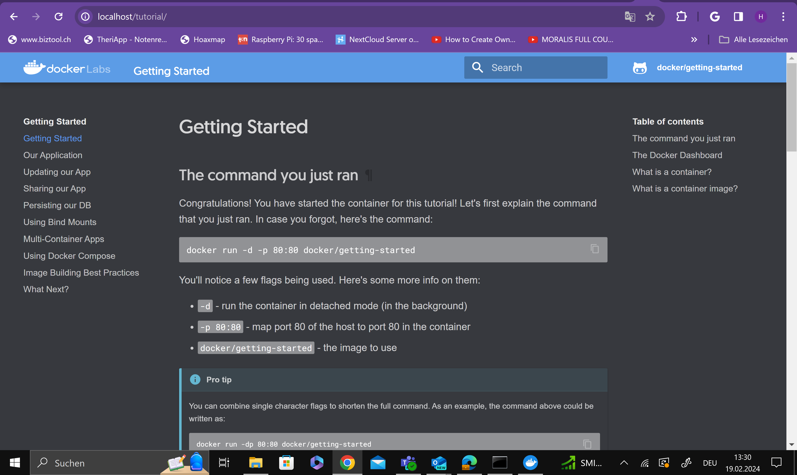
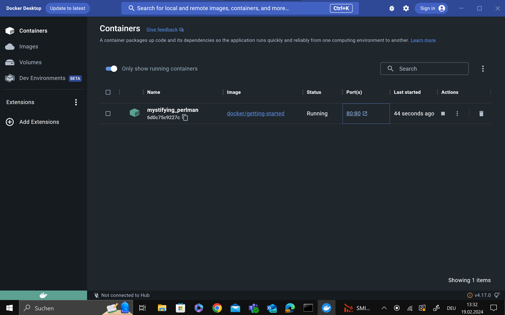
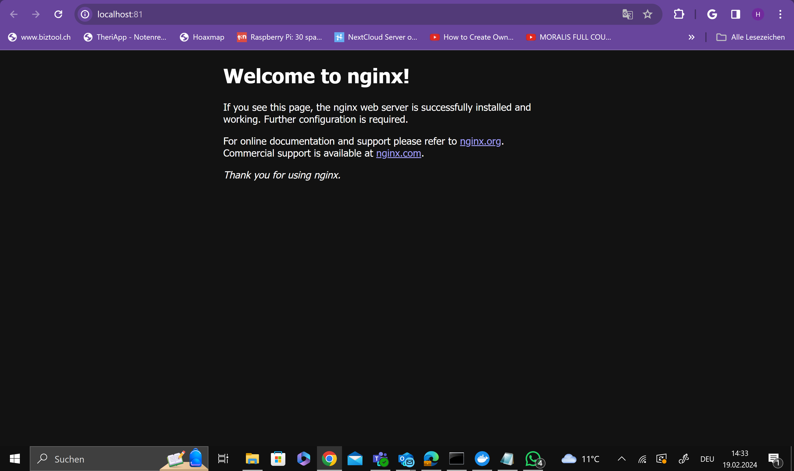
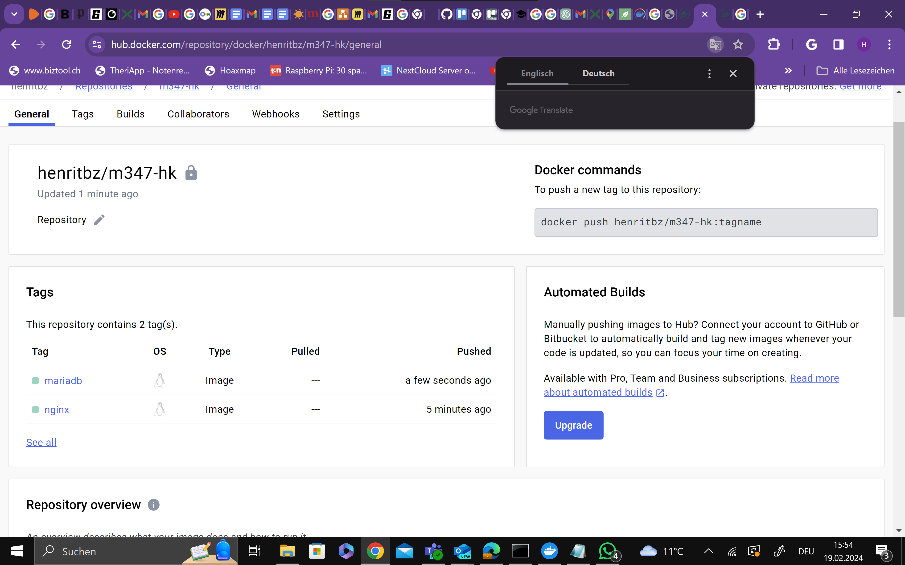

# KN01

## A)

 
 

## B)
1. docker run
2. docker search nginx
3. der Parameter d- bedeutet dasss der Docker im hintergrund "detach" läuft und gestartet wird. Der Parameter p- beschreibt auf welchen port der Docker von ausen zugänglich gemacht werden soll.
4. Docker pull nginx, docker create --name ngnixtest -p 80:81 nginx, docker start ngnixtest.
5. A) Das Image wurde heruntergeladen. Der Docker wurde erstellt mit dem Befehl aber nicht automatisch gestartet "docker run -d ubuntu". Der Docker wurde nicht automatisch gestartet und ich kann ihn auch nicht starten mit "docker start"
   B) mit dem Befehl "docker run -it ubuntu" konnte ich einen ubuntu Container erstellen. Der Container läuft auch direkt nach dme ich den Befehl uasgeführt habe. Es öffnet sich auch direkt eine neue Kommando Zeile mit der ich direkt mit dem Container kommunizieren kann.
6. docker exec -it nginxtest /bin/bash, service nginx status, exit   
8. docker stop nginxtest
9. docker rm elegant_diffie, docker rm trusting_ishizaka, docker rm mystifying_perlman
10. docker rmi ubuntu, docker rmi nginx

    
 
 

## C)

## D)
docker tag nginx:latest henritbz/m347-hk:nginx. Erklären Sie was dieser Befehl genau macht.
Was ist ein Tag? Ein Tag beschreib den Zustand von einem Image wie z.B die version oder den Namen.

docker push henritbz/m347-hk:nginx : Dieser befehl pushed die änderungen am repository auf das Online repository von Docker Hub.

docker pull mariadb

docker tag mariadb:latest henritbz/m347-hk:mariadb

docker push henritbz/m347-hk:mariadb

