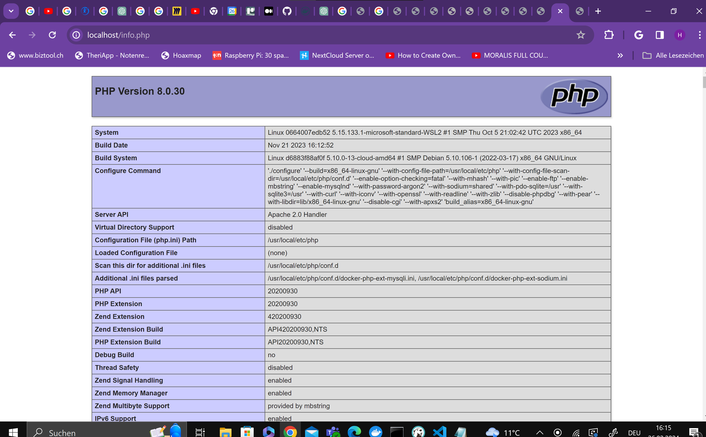

## KN02

# A
Dokumentiertes Dockerfile: 

FROM nginx:latest # Verwende das NGINX Basic image.
WORKDIR /usr/share/nginx/html 
COPY helloworld.html . # Kopiere den HTML code vom Host in den Container.
EXPOSE 80 # Macht den Port 80 für HTTP Anfragen frei.

docker build -t kn02a .

C:\Users\Henri Koch\Documents\M347\KN02>docker build -t kn02a .

docker tag kn02a:latest henritbz/m347-hk:kn02a

docker push henritbz/m347-hk:kn02a

docker run -d -p 8080:80 --name kn02a_Container kn02a

 
 

# B

Telnet Befehl mariadb
 

Dockerfile DB:

FROM mariadb:latest

ENV MARIADB_ROOT_PASSWORD="123"

EXPOSE 3306

Commands:

docker build -t kn02b-db .

docker run -d -p 3306:3306 --name kn02b_db kn02b-db

info.php 

 

db.php 

 

Dockerfile Web:

FROM php:8.0-apache

RUN docker-php-ext-install mysqli

COPY info.php /var/www/html/
COPY db.php /var/www/html/

EXPOSE 80

Commands: 

docker build -t kn02b-web .

docker run -d -p 80:80 --name kn02b_web --link kn02b_db kn02b-web

Angepasste PHP Datei

 

<?php
        //database
        $servername = "kn02b_db";
        $username = "root";
        $password = "123";
        $dbname = "mysql";

        // Create connection
        $conn = new mysqli($servername, $username, $password, $dbname);
        // Check connection
        if ($conn->connect_error) {
                die("Connection failed: " . $conn->connect_error);
        }

        $sql = "select Host, User from mysql.user;";
        $result = $conn->query($sql);
        while($row = $result->fetch_assoc()){
                echo($row["Host"] . " / " . $row["User"] . " ");
        }
        //var_dump($result);
?>

