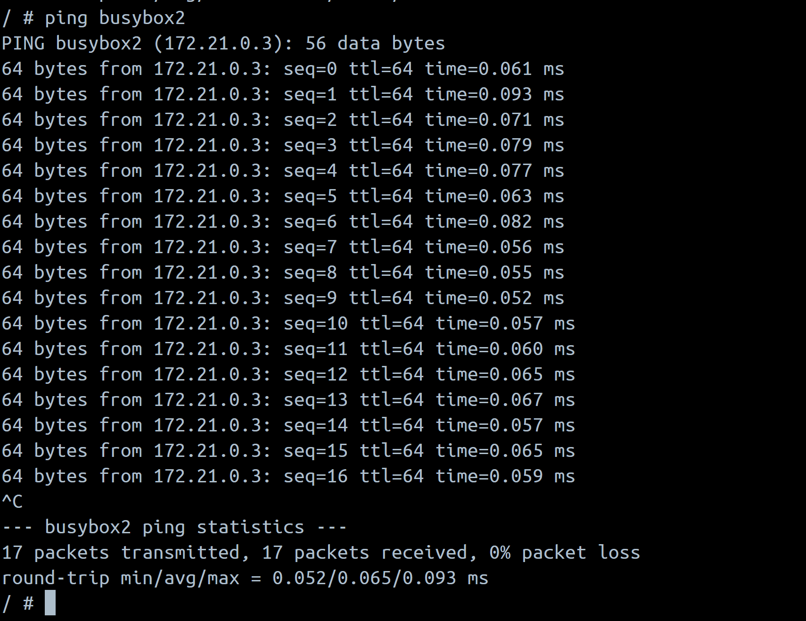
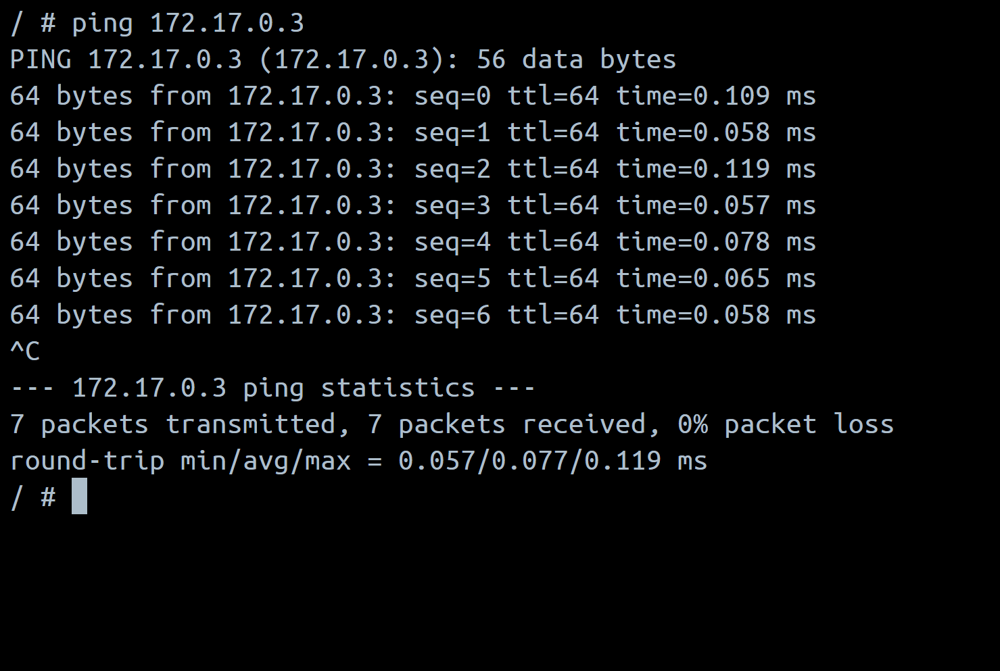

 
 

## Commands:

docker network create tbz

docker pull busybox:latest

docker run --name=busybox1 -itd --network=tbz busybox

docker run --name=busybox2 -itd --network=tbz busybox

docker run --name=busybox3 -itd --network=bridge busybox

docker run --name=busybox4 -itd --network=bridge busybox

## Aufgaben:

1)
busybox1: IP:172.21.0.2 Gateway:172.21.0.1
busybox2: IP:172.21.0.3 Gateway:172.21.0.1
busybox3: IP:172.17.0.2 Gateway:172.17.0.1
busybox4: IP:172.17.0.3 Gateway:172.17.0.1

2)
2. ping busybox2

3)
3. ping ip of "busybox4"

In Kn02 befanden sich die beiden Docker Container im Bridge Netzwerk. Sie konnten zusammen über den Link kommunizieren.
Nur die Container die im gleichen Netzwerk sind können miteinander mit namen kommunizieren. Wenn man mit Containern ausserhalb des netzwerkes kommunizieren möchte dann muss man dies mit der Ip Adresse tun.
