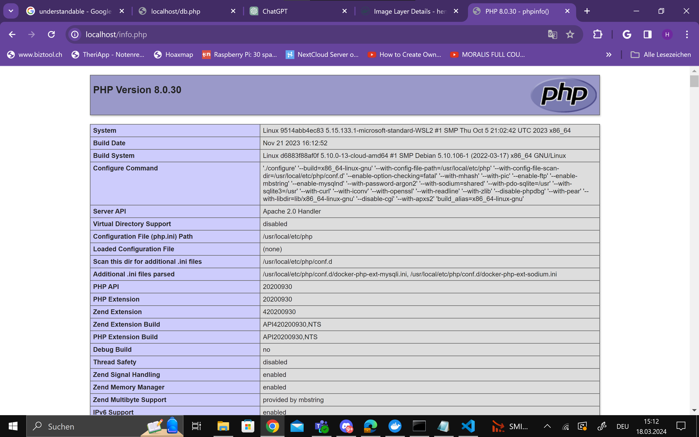

# 1
## A)

 

 

Docker compose
```
version: '3.8'

networks:
  m347-network:
    ipam:
      driver: default
      config:
        - subnet: 172.10.0.0/16
          ip_range: 172.10.5.0/24
          gateway: 172.10.5.254

services:
  m347-kn04a-db:
    image: mariadb:latest
    container_name: m347-kn04a-db
    environment:
      - MARIADB_ROOT_PASSWORD=123
    networks:
      - m347-network
    ports:
      - "3306:3306"

  m347-kn04a-web:
    build:
      context: .
      dockerfile: Dockerfile
    container_name: m347-kn04a-web
    ports:
      - "80:80"
    networks:
      - m347-network
```
Dockerfile
```
FROM php:8.0-apache

RUN docker-php-ext-install mysqli

COPY info.php /var/www/html/
COPY db.php /var/www/html/

EXPOSE 80
```
Commands
```
docker compose build: Mit dem Werden die Images erstellt.
docker compose create: Dieser Befehl erstellt die Container
docker compose start: Mit dem Befehl starten wir die Container.
```
## B)

 
 

Docker compose
```
version: '3.8'

networks:
  m347-network:
    ipam:
      driver: default
      config:
        - subnet: 172.10.0.0/16
          ip_range: 172.10.5.0/24
          gateway: 172.10.5.254

services:
  m347-kn04a-db:
    image: henritbz/uek233hk:kn02-db
    container_name: m347-kn04a-db
    environment:
      - MARIADB_ROOT_PASSWORD=123
    networks:
      - m347-network
    ports:
      - "3306:3306"

  m347-kn04a-web:
    image: henritbz/uek233hk:kn02-web
    container_name: m347-kn04a-web
    ports:
      - "80:80"
    networks:
      - m347-network
```
Erklearung: Weil wir im Image schon Variable werte hardcodiert haben wird es nicht gehen

# 2

 
 

Cloud Init
```
#cloud-config
# source: https://gist.github.com/syntaqx/9dd3ff11fb3d48b032c84f3e31af9163
users:
  - name: ubuntu
    sudo: ALL=(ALL) NOPASSWD:ALL
    groups: users, admin
    home: /home/ubuntu
    shell: /bin/bash
    ssh_authorized_keys:
      - ssh-rsa AAAAB3NzaC1yc2EAAAADAQABAAABAQCUBo+qnNu5xxM9vfz4C04M36FHxHNrEMdm5TkFj1/SfVtqunlUOeMpu7nFCZZKnX8HYwf/MkjcBiTYAgncxku8grwl6XuW/pcvmb6/ghSIaw4xtRRSzit7omqJ5d8kXB3+Nd1aaMHsjfly4nkaqswhySVXQqr8Hw6DbWVw8jLLVKEE+5NZHY33hJkhJwK4blCllsGpmQaKi1qxjsN0hZOWNK01iJAydwD8t2xJ0NOYbq8Qas5IyPnRN7SPxvEhIP6WLQ6Ym6Dmf8FwNW1cHLTKabgjzt5f/HKUkKS89dPd3fn4nnFli1BOMECGUIvVlOw2pQNri7+04OOfn2FGlqr5 teacher
      - ssh-rsa AAAAB3NzaC1yc2EAAAADAQABAAABAQCtcaqd2K6cwAvevPb6SCWu8RHPk8mY9evjXb02sJ2PmI6oR9JoTEn6m7nGZRJ7fIHUU7+T37T6w9xvDQ9LEtd7CaLxr5b3ZcNprncTjssLfopva5oLpsomNzSEZDHSRKdTq+UOkm2PBY3QjBOoMI/qWfnguNxXXVzFvAttT3KHiXdD3yiC6LgUL/bBbbRvNEUvM8UQcy/s8PiNcsZlmAcZpNfTr+RxLP52oS1VJDy0BTXdMEct+DIV6/YaQn5Lmc4ep8xpIGIcBQCocDeYsY4hukSN8V/MRQJ54jdJjzLeXtP0SP4FvjCZ4YDW3NKigZjiY55Cnij1Fhe0//HuUUZD
ssh_pwauth: false
disable_root: false
package_update: true
package_upgrade: true
groups:
  - docker
system_info:
  default_user:
    groups:
      - docker
packages:
  - apt-transport-https
  - ca-certificates
  - curl
  - gnupg
  - lsb-release
  - unattended-upgrades
final_message: The system is finally up, after $UPTIME seconds
write_files:
  - path: /home/ubuntu/src/db.php
    permissions: "0644"
    content: |
      <?php
        //database
        $servername = "m347-kn04a-db"; // Private IP Adresse des DB Server
        $username = "root";
        $password = "123";
        //$dbname = "example-database";

        // Create connection
        $conn = new mysqli($servername, $username, $password);//, $dbname);
        // Check connectionsa<
        if ($conn->connect_error) {
          die("Connection failed: " . $conn->connect_error);
        }
        $sql = "select Host, User from mysql.user;";
        $result = $conn->query($sql);
        while($row = $result->fetch_assoc()){
          echo($row["Host"] . " / " . $row["User"] . "<br />");
        }
        //var_dump($result);
      ?>
  - path: /home/ubuntu/src/info.php
    permissions: "0644"
    content: |
      <?php
        phpinfo();
      ?>
  - path: /home/ubuntu/dockerfile
    permissions: "0644"
    content: |
      FROM php:8.0-apache
      WORKDIR /var/www/html/
      COPY src .
      EXPOSE 80
      RUN ["docker-php-ext-install", "mysqli"]
  - path: /home/ubuntu/docker-compose.yaml
    content: |
      version: '3'
      networks:
        m347-network:
          ipam:
            driver: default
            config:
              - subnet: 172.10.0.0/16
                ip_range: 172.10.5.0/24
                gateway: 172.10.5.254
      services:
        web:
          build:
            context: .
            dockerfile: Dockerfile
          container_name: m347-kn04a-web
          ports:
            - "80:80"
          networks:
            - m347-network
        db:
          image: mariadb:latest
          container_name: m347-kn04a-db
          environment:
            - MARIADB_ROOT_PASSWORD=123
          networks:
            - m347-network
          ports:
            - "3306:3306"
runcmd:
  - mkdir -p /etc/apt/keyrings
  - curl -fsSL https://download.docker.com/linux/ubuntu/gpg | gpg --dearmor -o /etc/apt/keyrings/docker.gpg
  - echo "deb [arch=$(dpkg --print-architecture) signed-by=/etc/apt/keyrings/docker.gpg] https://download.docker.com/linux/ubuntu $(lsb_release -cs) stable" | tee /etc/apt/sources.list.d/docker.list > /dev/null
  - apt-get update
  - apt-get install -y docker-ce docker-ce-cli containerd.io docker-compose-plugin
  - systemctl enable docker
  - systemctl start docker
  - cd /home/ubuntu
  - sudo docker compose up -d
```
