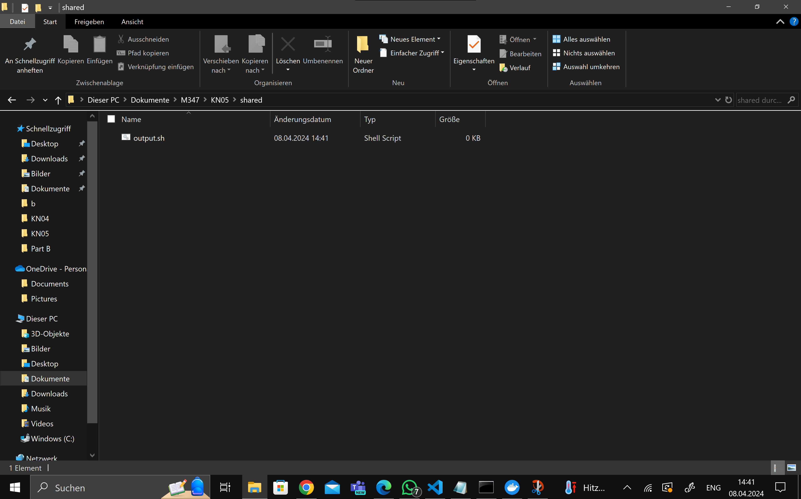
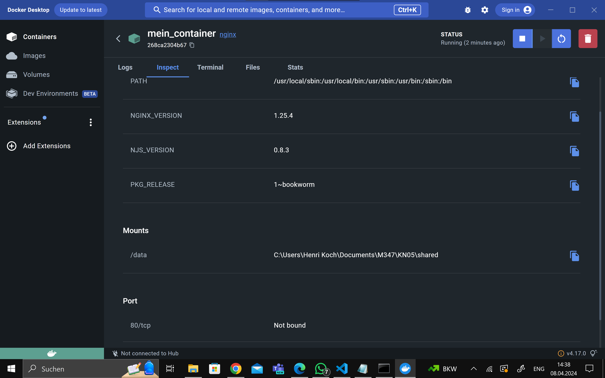
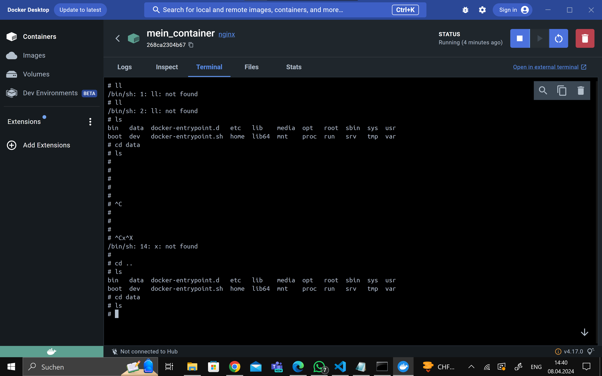
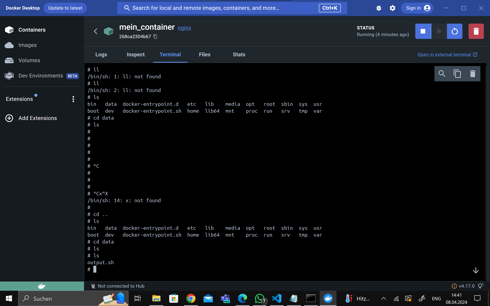
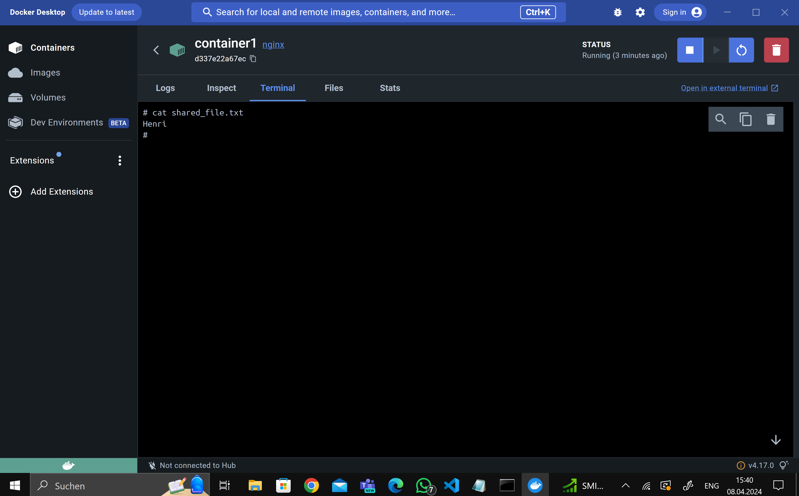
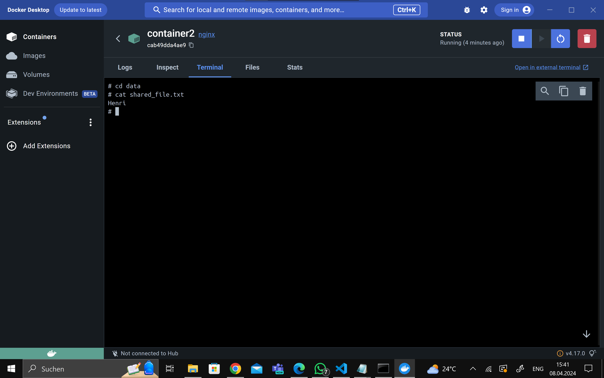
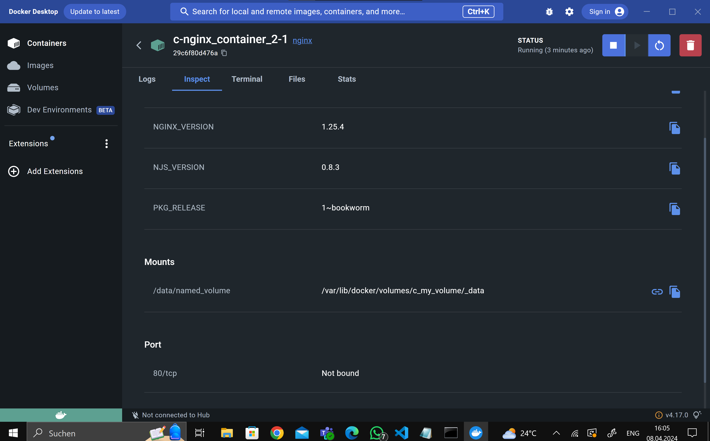
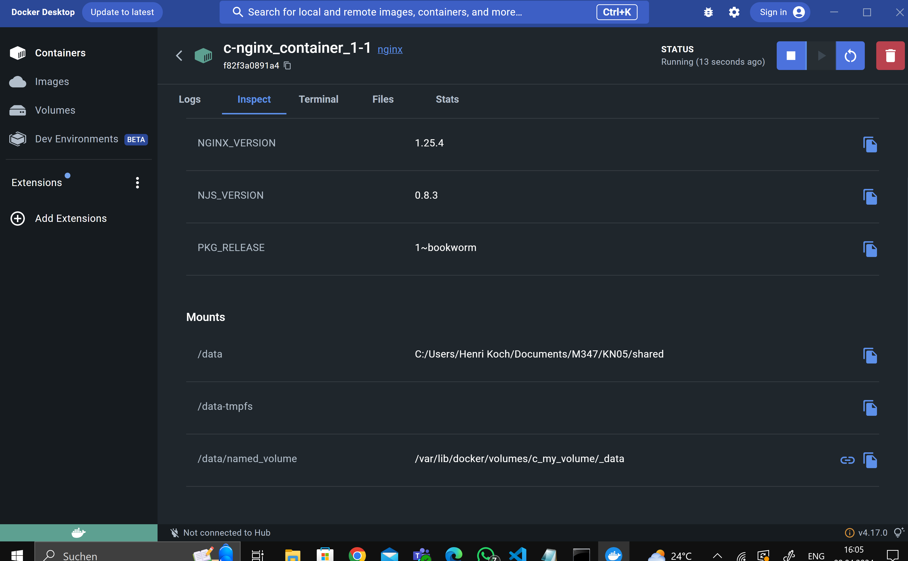

# A)
```
docker run -d --name mein_container -v "C:\Users\Henri Koch\Documents\M347\KN05\shared":/data nginx
```





# B)

```
docker volume create my_volume
docker run -d --name container1 -v my_volume:/data nginx
docker run -d --name container2 -v my_volume:/data nginx

echo "Henri" > /data/shared_file.txt

```




# C)




```
version: '3'
services:
  nginx_container_1:
    image: nginx
    volumes:
      - type: volume
        source: my_volume
        target: /data/named_volume
      - type: bind
        source: "C:/Users/Henri Koch/Documents/M347/KN05/shared"
        target: /data
      - type: tmpfs
        target: "/data-tmpfs"

  nginx_container_2:
    image: nginx
    volumes:
      - my_volume:/data/named_volume:ro

volumes:
  my_volume:
```
