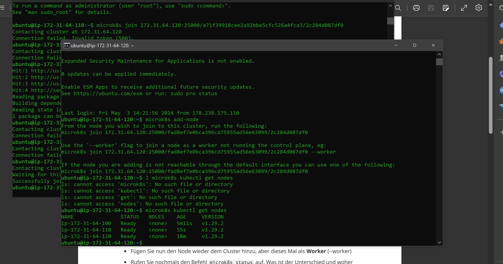
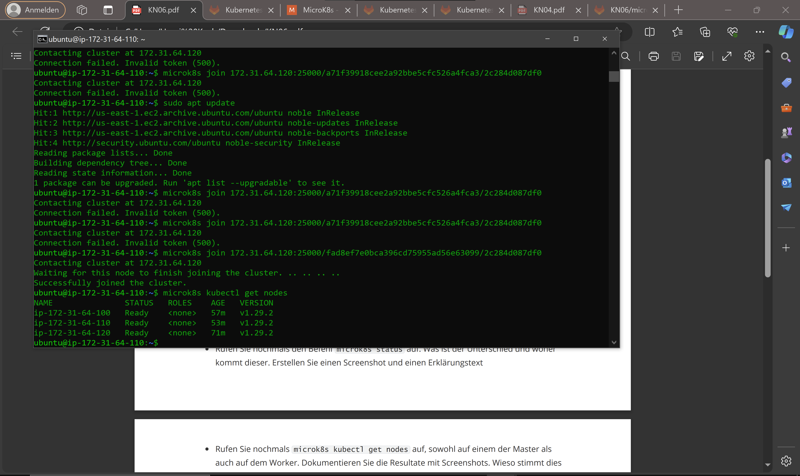
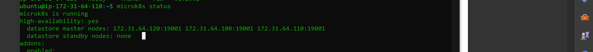
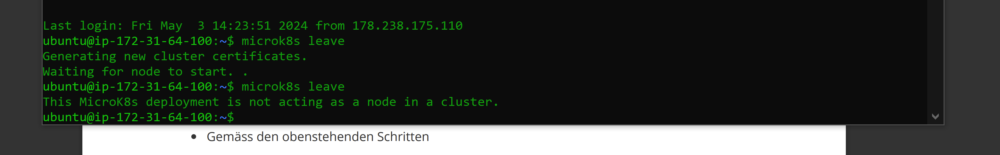
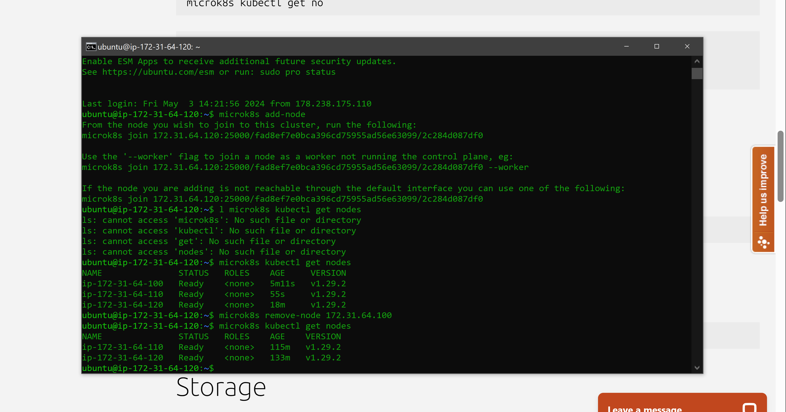
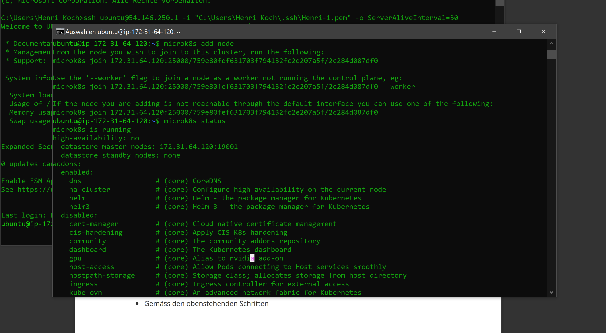
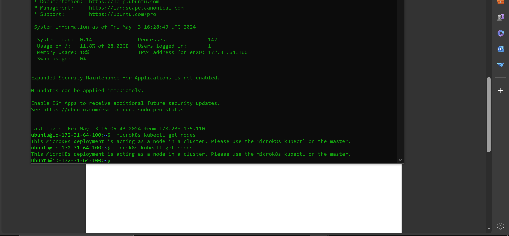
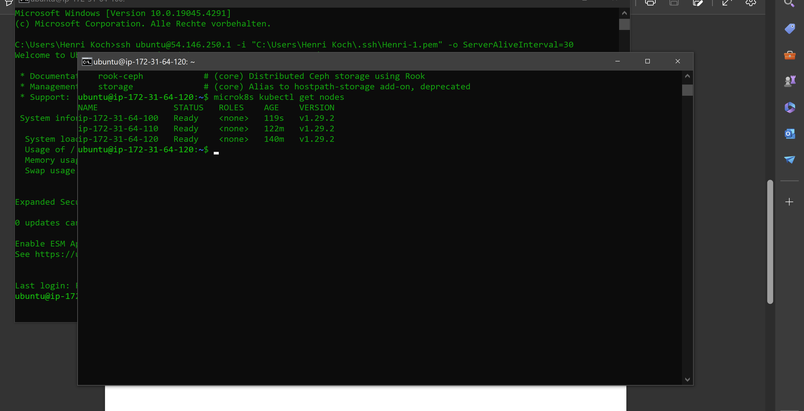

# A

# B

High Availability heisst das auch wenn eine node heruntergefahren wird, die anderen aktiv noch weiterlaufen.

Worker nodes gehören nicht zu den Nodes welche mit High availability arbeiten.

Worker nodes können keinen status get nodes ausführen

Der unterschied ist das man mit microk8s einzelne nodes verändern und bearbeiten kann aber mit microk8s kubectl kann man den ganzen cluster bearbeiten.
