# A

Ein Replica und ein Pod sind unterschiedlich. Ein Replica sorgt dafür, dass alle Pods in einem Cluster richtig konfiguriert und erstellt sind. Ein Pod ist die kleinste Einheit in Kubernetes und kann mehrere Container ausführen. Mehrere Pods können auf einem Node sein, welcher das Betriebssystem ist, auf dem die Pods laufen, aber es ist keine 1-zu-1-Beziehung.

Ein Service ermöglicht die Kommunikation zwischen den Nodes im Cluster. Das Deployment ist verantwortlich für das Skalieren der Nodes und Pods im Cluster. 

Ingress ermöglicht den Zugriff von außerhalb des Clusters. Es setzt bestimmte Netzwerkregeln und ermöglicht Load-Balancing von externen Anfragen. Das schützt vor unerlaubten Verbindungen von außen.

Ein StatefulSet ist ähnlich wie ein Deployment, aber der Unterschied besteht darin, dass es teilweise mit jedem Pod verbunden ist. Das bedeutet, dass wenn ein Pod erstellt wird, es auf einem Beispiel basiert, aber nicht alle gleich sind. Das ermöglicht es, verschiedenen Pods unterschiedlichen Speicherplatz zuzuweisen. Zum Beispiel könnte für einen Webserver die index.html persistent gespeichert werden.

# B

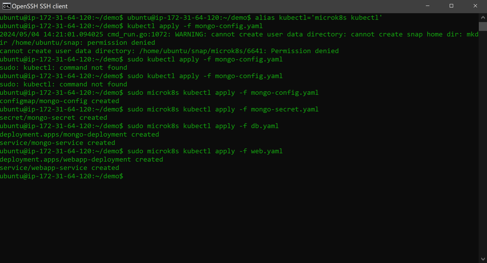
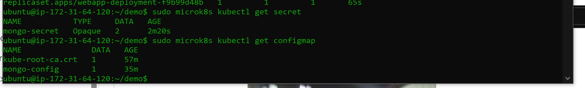
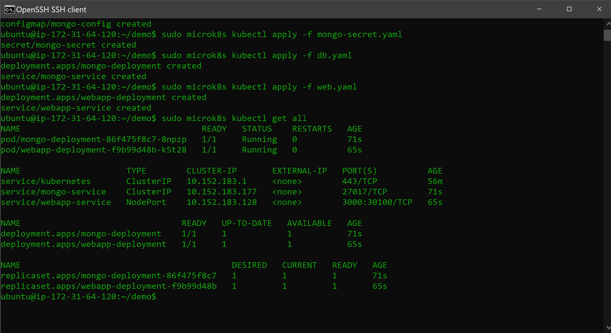

Der Url weisst auf die MongoDB und da reicht es wenn man den Namen des DB Containers gibt.

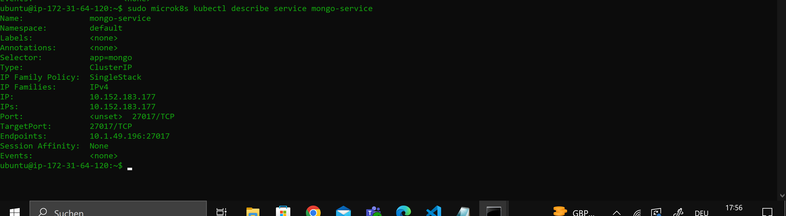
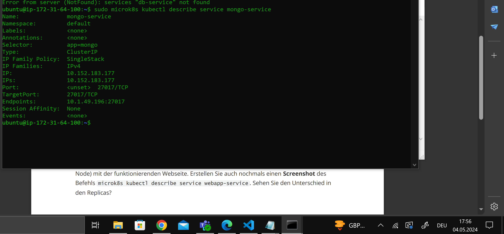

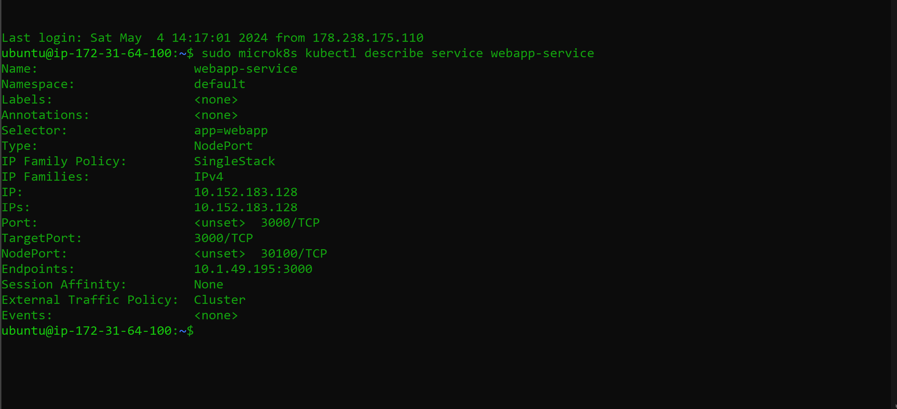
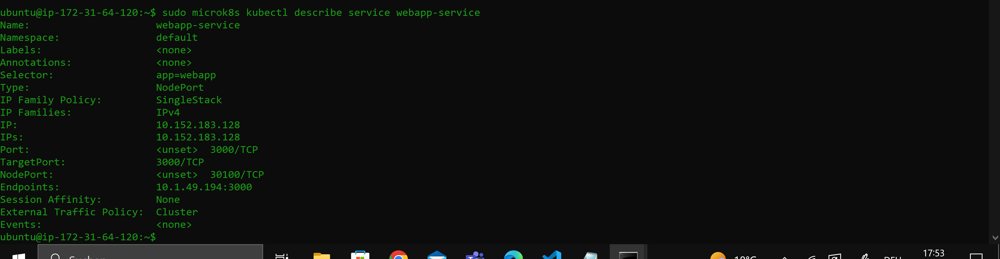

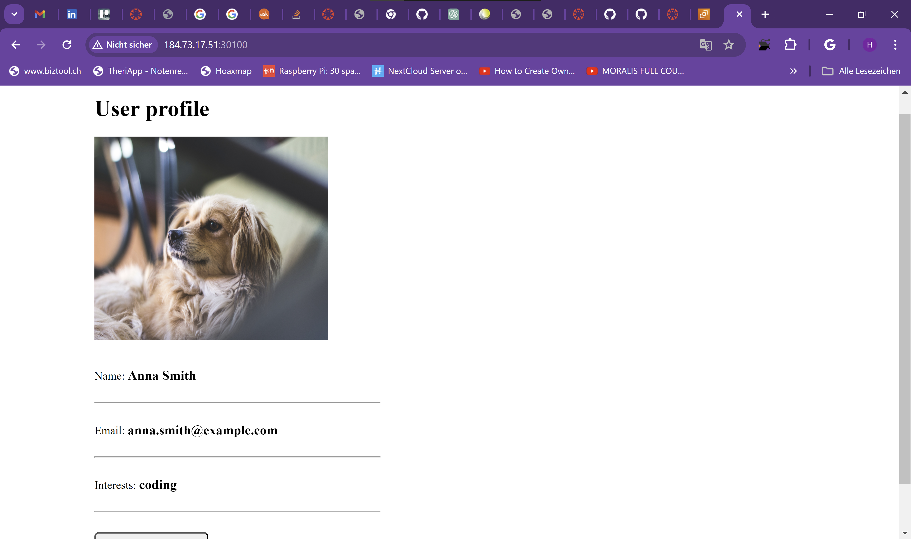
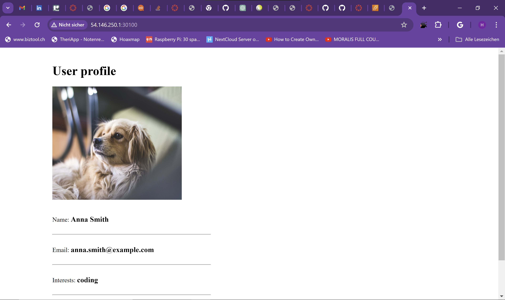

Ich musste den Port 30100 fü einkommenden Datenverkehr öffnen.

### Verbindung mit MongoDB Compass

Es geht nicht weil wir die Ports dafür nicht geöffnet haben im AWS und im DB.yaml und weil wir der DB keinen NodePort gegeben haben und sie so nicht ansprechen können.

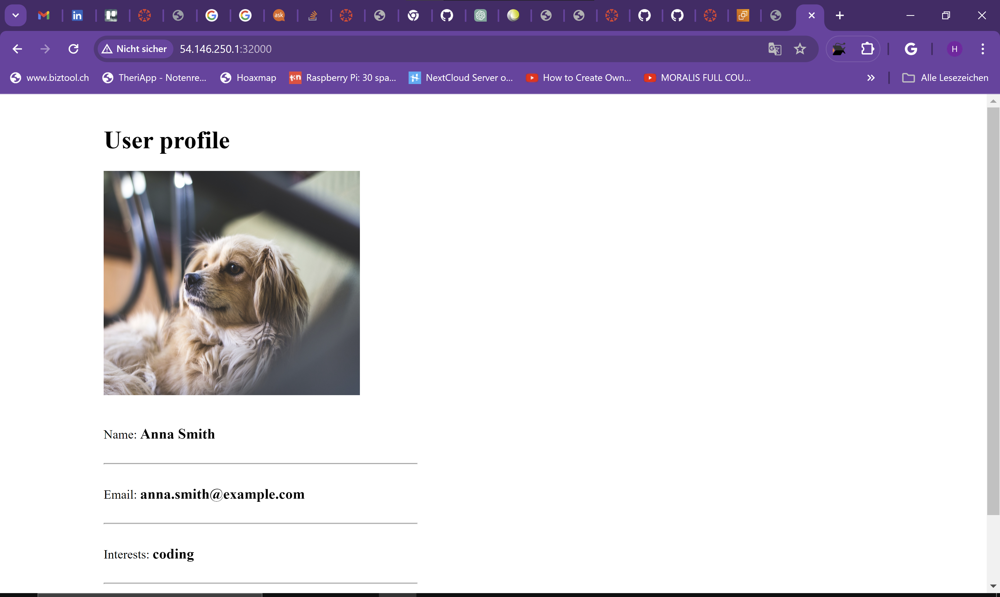
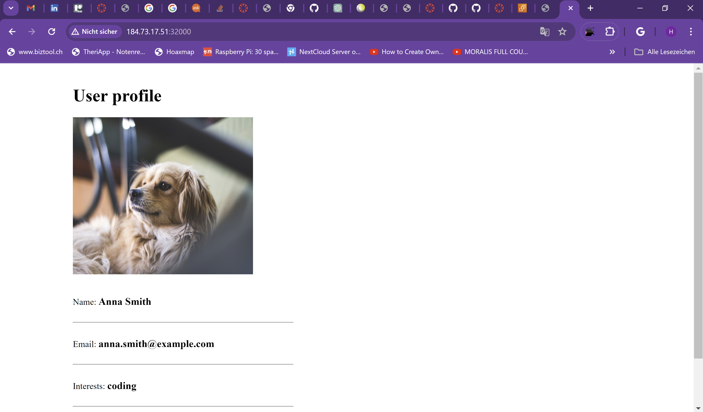

Ich habe das file angepasst und nochmals mit "microk8s kubectl apply -f web.yaml" wieder deployed.

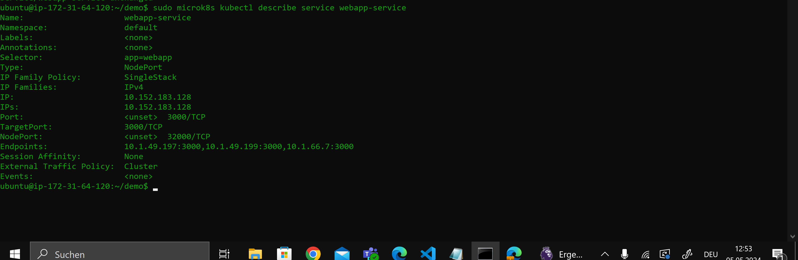
